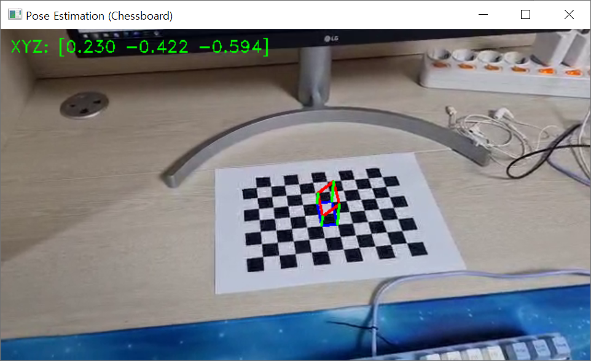
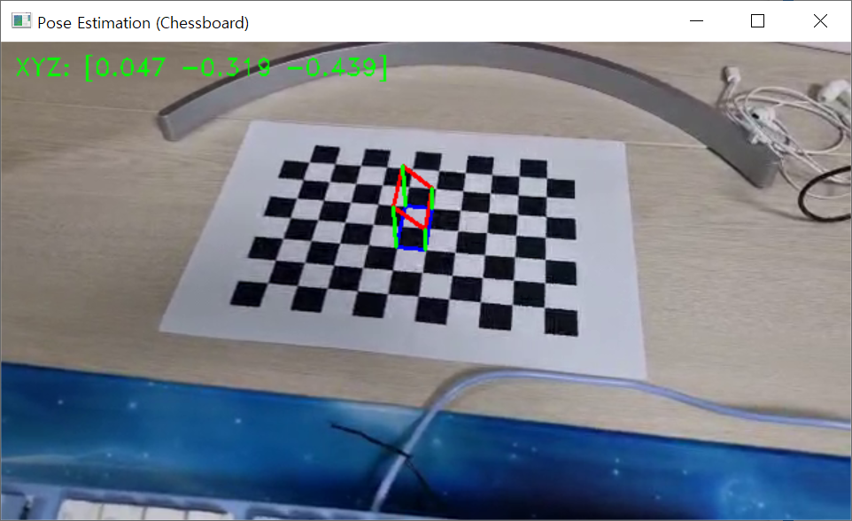

Python의 cv2를 사용하여 카메라의 행렬과 카메라의 렌즈 왜곡계수를 구하고 왜곡을 조정하고 체스보드 위에 AR 물체 시각화 하기
fix distortion on image through camera's matrix and camera's lens distortion factor and visualize AR object on chessboard  

[about camera pse estimation](https://github.com/nw9233fr2864/camera_calibration)

기능: 체크보드를 사용하여 카메라의 행렬과 카메라의 렌즈 왜곡계수 획득, 왜곡된 이미지를 보정, AR물체 시각화  

왜곡된 이미지 보정 방법: 두 번째 ipynb의 K(카메라의 행렬)와 dist_coeff(카메라의 렌즈 왜곡계수)에 위에서 구한 값을 넣어 작동  

camera.mp4의 이미지 19장을 통해 얻은 RMSE, K, dist_coeff

Camera Calibration Results The number of selected images = 19
RMS error = 0.2977032173655103
Camera matrix (K) =
[[508.98163886 0. 308.60528522]
[ 0. 500.87912124 164.43847802]
[ 0. 0. 1. ]]
Distortion coefficient (k1, k2, p1, p2, k3, ...) = [ 4.59282634e-02 1.10172235e-01 -2.56248711e-04 -3.30348010e-03 -3.50814245e-01 ]

움직이는 AR 물체를 영상에 그린 예시  
좌우가 들썩하는 사진을 확인할 수 있다.  

